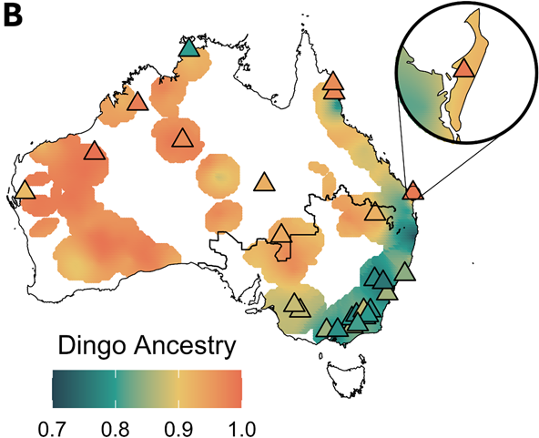
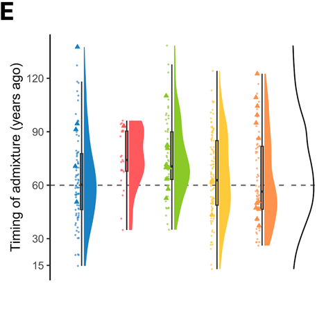
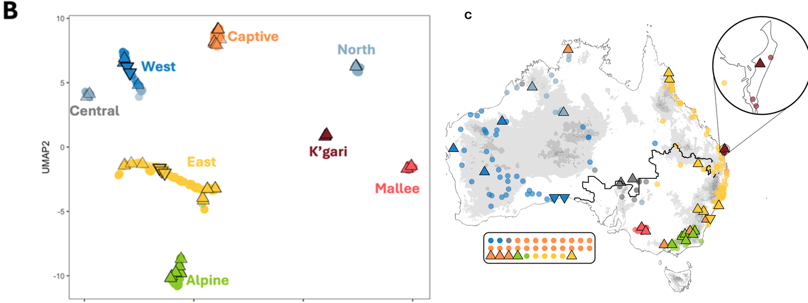
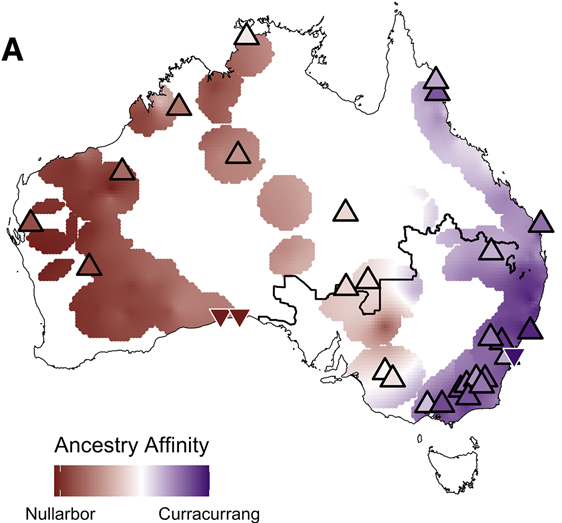
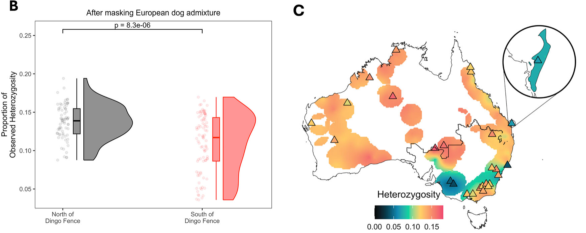
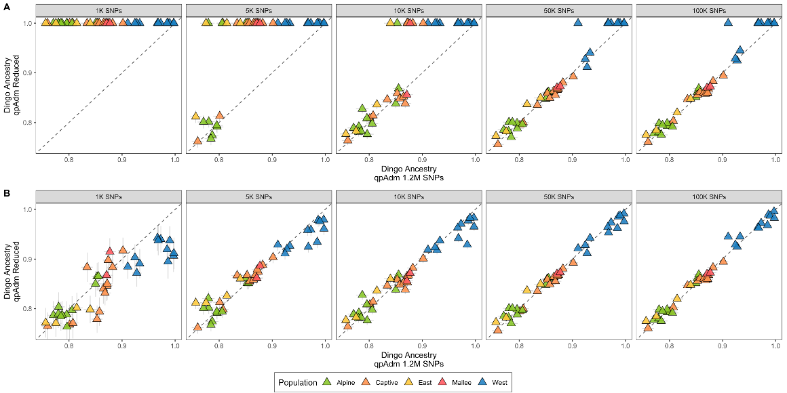

Across much of rural Australia, any free-roaming canine that troubles a flock tends to be filed under a single label: *wild dog*. The label is administratively tidy, but it hides a question that has divided ecologists, geneticists and managers for decades — how much of the animal in front of you is dingo, and how much is descended from European dogs brought ashore after 1788? Today, in [*Conservation Letters*](https://doi.org/10.1111/conl.70052), we publish a study that finally lets that question be answered cheaply, consistently, and at scale. Our headline result: averaged across more than 300 free-roaming canines sampled around the continent, just 11.7% of the genome comes from domestic dogs. The rest is dingo.

<!--more-->

A companion piece written for a general audience is available on *The Conversation*: [Most of Australia's 'wild dogs' are actually dingoes — here's why that matters](https://theconversation.com/). The post below adds a little more of the genetic detail behind those numbers, for readers who want to look under the bonnet.

## Why this needed sorting out

Dingoes have been on the Australian mainland for more than three thousand years, and for most of that time they have been the continent's sole terrestrial apex predator. They are kin, companion and totem to many Indigenous Australians, and they continue to do real ecological work — suppressing mesopredators and shaping prey communities in ways that other Australian carnivores cannot replace.

They also kill sheep. Since the early colonial period, that conflict has driven a regime of lethal control, capped by the 5,615 km Dingo Fence — one of the longest structures ever built by humans. Modern policy in some jurisdictions hangs on the idea that "pure" dingoes are vanishingly rare in the south-east, and that what farmers encounter is mostly hybrid stock with European dogs. If that were true, broad-brush culling would be defensible. If it is not, the policy is eroding an ancient, culturally significant lineage.

The trouble is that genetics has, until now, given contradictory answers. Microsatellite tests (the long-standing 24-locus STR assay) routinely reported that most south-eastern dingoes were heavily admixed. Newer SNP-array and DArT tests, applied to the same kinds of animals, reported almost no admixture at all. Two well-respected methods, two very different management implications, no clean way to choose between them.

## A new reference fixes the problem

The reason both methods drifted is the same: they relied on contemporary "reference" dingoes to define what a pure dingo looks like. If those references already carry European dog ancestry, every estimate downstream is biased — sometimes upward, sometimes downward, depending on the algorithm.

We sidestepped this by using **precolonial dingo paleogenomes** — ancient DNA from animals that lived on the continent before European dogs ever arrived — as the true ancestral baseline. Combined with a model-based ancestry estimator (qpAdm, run with four high-coverage German Shepherd genomes representing the European dog source), this gives a reference that cannot, by definition, be contaminated by colonial admixture.

The approach is also robust to data type. We ran 347 individuals — 299 typed on a SNP-array, 48 with whole-genome sequencing — through the same framework and obtained internally consistent estimates. As few as **10,000 well-chosen transversion SNPs** are enough to recover the same answer the whole genome gives. Routine ancestry screening, in other words, no longer needs a whole-genome budget.

## Key findings

**Dingo ancestry is high almost everywhere, but European dog ancestry is regional rather than continental.** Across the country, free-roaming canines average 88.3% dingo ancestry — the "wild dog" label is, in genetic terms, a misnomer for most of the animals it gets applied to. European dog ancestry is highest in the south-east (Victoria, New South Wales, the Alps), lowest in the remote north and west, and tracks human population density: the more people, the more dog ancestry. The Dingo Fence shows up as a sharp discontinuity, with significantly higher admixture on its southern, agricultural side.

**Admixture is largely historical.** Gene flow from European dogs peaked roughly 20–25 generations ago, around the **1950s–1960s** (dashed line at ~60 years ago) — coinciding with rapid post-war agricultural expansion in south-eastern Australia. It is not an ongoing avalanche; first-generation hybrids are rare. Where unadmixed mates remain available, ancestry can recover over a few generations.

**Eight genetically distinct dingo populations, two of them new.** A UMAP of dingo-ancestry segments (left) resolves eight clear clusters; mapping those clusters back onto the continent (right) shows where each lives. Earlier work resolved five subgroups (West, East, Alpine, Mallee, Captive) and the isolated K'gari (Fraser Island) population. After masking European dog ancestry, we additionally identify a **Northern** and a **Central** cluster, the latter sitting at the junction of the West, North and East lineages and acting as a zone of high gene flow.

**Ancient lineages persist.** Modern populations retain deep affinities to two ancestral lineages — **Nullarbor** (western dingoes, in red) and **Curracurrang** (eastern dingoes, in purple) — divisions that predate European contact by thousands of years and reflect biogeographic barriers like the Great Dividing Range and the Murray–Darling system.

**South-eastern dingoes are diversity-poor once dog ancestry is removed.** With European dog DNA included, southern populations look as diverse as northern ones. Mask that DNA out (left) and the picture flips: ancestral dingo heterozygosity is significantly lower in the south (*p* = 8.3 × 10⁻⁶). Mapped across the continent (right), the lowest ancestral diversity sits in the south-east and around the Mallee (Big Desert) of north-western Victoria. Dog admixture has inflated overall heterozygosity but eroded the lineage-specific variation that makes south-eastern dingoes evolutionarily distinct.

**Affordable testing changes what management can do.** Supplementary Figure S4 compares dingo-ancestry estimates from reduced marker panels — 1K, 5K, 10K, 50K and 100K SNPs — against the full 1.2 million-SNP reference. From around **10,000 SNPs** onwards, the points line up tightly on the 1:1 diagonal across all populations. Because qpAdm works reliably with low-pass shotgun data and a few thousand well-chosen markers, wildlife agencies can now screen large numbers of animals without a whole-genome budget for each one.

## Ancestry by population

| Dingo Group | Dingo Ancestry (% ± Std. Err) | Dog Ancestry (% ± Std. Err) |
| ----------- | ----------------------------- | --------------------------- |
| Alpine      | 81.8% ± 0.6                   | 18.2% ± 0.6                 |
| Captive     | 86.8% ± 0.7                   | 13.2% ± 0.7                 |
| Central     | 94.4% ± 0.9                   | 5.6% ± 0.9                  |
| East        | 84.6% ± 0.4                   | 15.4% ± 0.4                 |
| K'gari      | 98.7% ± 1.5                   | 1.3% ± 1.5                  |
| Mallee      | 86.9% ± 1.0                   | 13.1% ± 1.0                 |
| North       | 97.1% ± 0.9                   | 2.9% ± 0.9                  |
| West        | 97.1% ± 0.6                   | 2.9% ± 0.6                  |

Even the most admixed group — the Alpine population — is still more than 80% dingo by ancestry. The northern, western, central and K'gari groups are essentially unadmixed.

## What this means for management

A predominantly dingo individual is not a stray domestic dog, and management policy should stop treating the two as equivalent. Three concrete implications follow from the results:

1. **Regional, not national, calibration.** Ancestry varies systematically across the continent. A blanket "wild dog" rule applied uniformly from the Kimberley to the Victorian Alps cannot reflect the genetic reality on the ground.
2. **Avoid culling-driven erosion of ancestral diversity.** In the south-east, where ancestral diversity is already low and dog ancestry is concentrated, indiscriminate lethal control risks removing the very animals that carry the most distinctive dingo lineages. Management informed by ancestry estimates can do better.
3. **Indigenous partnership is non-negotiable.** Dingoes are kin to many Indigenous Australian communities and have been for thousands of years. Future research, planning and conservation action should be co-developed with local Indigenous groups — both as a matter of cultural integrity and because that knowledge improves the science.

We also see paleogenomes themselves as the methodological lesson here. Ancient DNA is sometimes treated as a curiosity —interesting for telling stories about the past- but tangential to applied biology. This study shows the opposite. By providing an unadmixed baseline that contemporary populations can no longer supply, paleogenomes turned a long-running disagreement about a living species into a tractable conservation question.

## Citation

Ravishankar S, Nguyen NC, Taufik L, Michielsen NM, Bergström A, Tobler R, Fordham D, Brüniche-Olsen A, Rahbek C, Llamas B, Souilmi Y. (2026). **Paleogenomics-Informed Inferences of European Dog Admixture Enables Scalable Dingo Conservation.** *Conservation Letters*. DOI: [10.1111/conl.70052](https://doi.org/10.1111/conl.70052)

**[📄 Read the full open-access paper](https://doi.org/10.1111/conl.70052)** | **[📰 Read the *Conversation* piece](https://theconversation.com/new-dna-evidence-shows-dingoes-are-almost-90-pure-and-fall-into-eight-distinct-groups-282381)** **[📰 Read the Press Release](https://adelaide.edu.au/about/news/2026/most-australian--wild-dogs--are-predominantly-dingoes/)**

**Journal**: *Conservation Letters*
**Published**: 14 May 2026
**DOI**: [10.1111/conl.70052](https://doi.org/10.1111/conl.70052)

*Figure panels reproduced from Ravishankar et al. (2026), Conservation Letters, under the [Creative Commons Attribution 4.0](https://creativecommons.org/licenses/by/4.0/) licence.*
